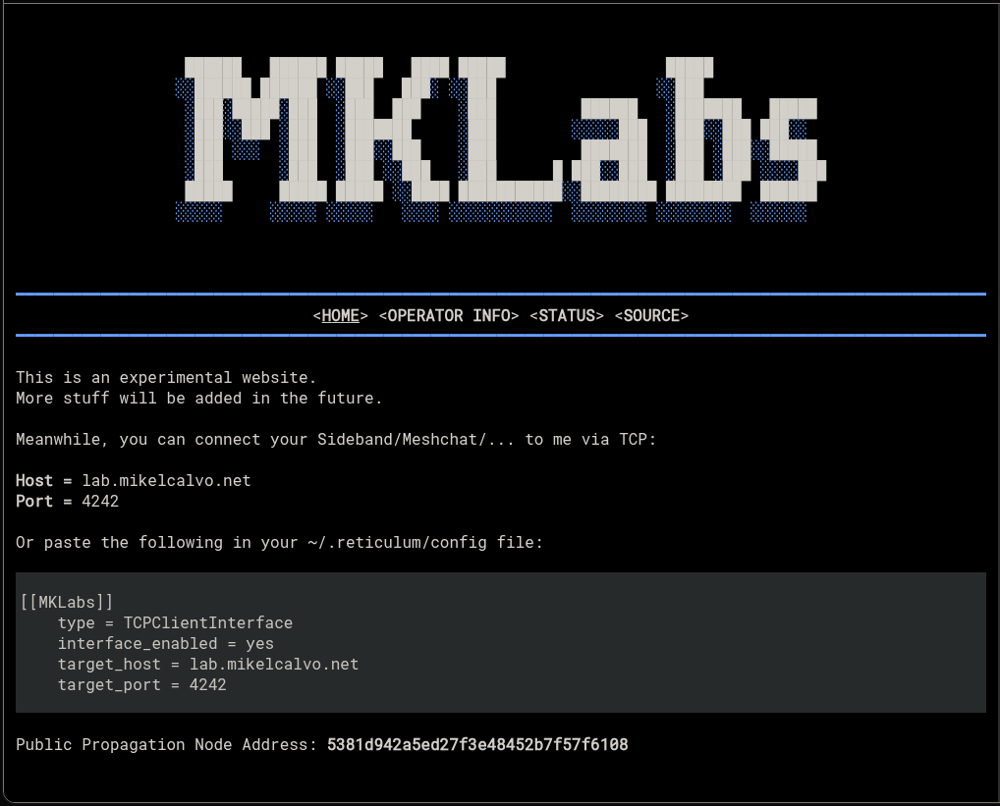

This is a personal website I'm making for NomadNetwork.

It's still a work in progress, but you can already test it at the following address:

```
3c81447dff85b425c79ca5a97ff75f75:/page/index.mu
```

### Website Features

- An isolated ccomponent for the logo
- An isolated component for the topbar, with current page automatically highlighted
- An isolated component for the footer, with the number of visits to each page

### Project Roadmap

- [ ] Find an alternative header logo, current is broken on NomadNet (works on Meshchat)
- [ ] Add basic system info to the status page
- [ ] Add a guestbook page

### Setup helper

To copy the pages and scripts into your local NomadNet storage, run the interactive setup:

```bash
python3 setup.py
```

You can choose the storage directory (defaults to `~/.nomadnetwork/storage`) and decide how to handle file collisions (keep your current file or overwrite with the project version).

### Analytics script

There is a small helper script to inspect page visits stored in `~/.nomadnetwork/storage/pages_analytics.json`:

```bash
python3 scritps/analytics.py
```

It prints a nicely formatted summary with:

- Total visits per page (sorted by most visited)
- First and last visit timestamps per page
- Overall number of log records and global time range

### What is Nomad Network?

Nomad Network (NomadNet) is a terminal-based hypertext system for communicating and sharing content over delay-tolerant mesh and long-range radio networks.  
It is designed to work well over Reticulum-based networks, even on very low-bandwidth and high-latency links.  
More info and source code: [`NomadNet on GitHub`](https://github.com/markqvist/NomadNet).

### What is Reticulum?

Reticulum is a cryptographically secure networking stack built for resilient, censorship-resistant and delay-tolerant networks.  
It allows you to build mesh networks over many different physical transports (LoRa, packet radio, Ethernet, IP, serial links, etc.).  
More info and source code: [`Reticulum on GitHub`](https://github.com/markqvist/Reticulum).

### Thanks to

- [@markqvist](https://github.com/markqvist) for creating Reticulum & Nomad Network
- [@liamcottle](https://github.com/liamcottle/reticulum-meshchat) for creating Meshchat
- [@SebastianObiwan](https://github.com/SebastianObiwan) for creating the base page template I used as a starting point
- [Spanish Reticulum Telegram channel](https://t.me/Reticulum_es) for helping me with my questions and testing the website
